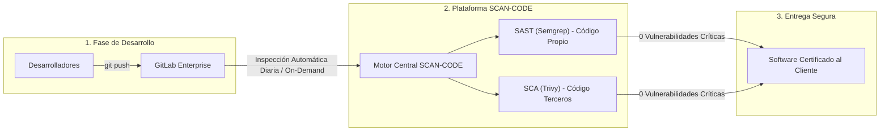
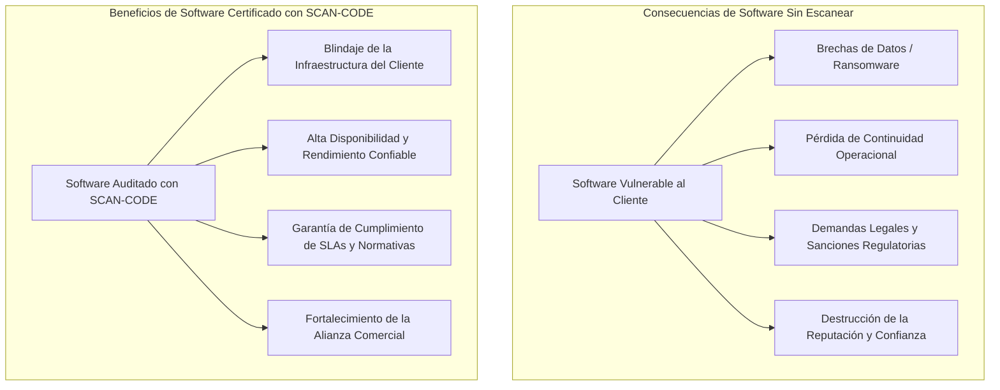

# Plataforma Central de Seguridad de Código (SCAN-CODE)
## *Visión General, Buenas Prácticas de Desarrollo Seguro y Gestión del Riesgo en la Cadena de Suministro*

**Documento Técnico-Comercial y de Gobierno de Seguridad**  
**Versión:** 2.0  
**Audiencia:** Gerencia de TI/Ciberseguridad, Líderes Técnicos, Auditores y Clientes  

---

## 1. ¿Qué es SCAN-CODE y para qué sirve?

El **Portal Central de Escaneo de Código (SCAN-CODE)** es una plataforma de gobierno y auditoría de seguridad que automatiza la inspección de vulnerabilidades en todo el ciclo de vida del desarrollo de software (*SDLC - Software Development Life Cycle*).

Su propósito principal es actuar como un **guardián automatizado de calidad y seguridad**, inspeccionando de forma centralizada y continua todos los repositorios alojados en **GitLab** mediante dos disciplinas esenciales de ciberseguridad:

1. **SAST (*Static Application Security Testing* - Semgrep):** Inspecciona el código fuente escrito por los desarrolladores para identificar defectos de programación, malas prácticas, funciones inseguras o secretos expuestos.
2. **SCA (*Software Composition Analysis* - Trivy):** Audita todas las librerías, módulos y componentes de terceros (*Open Source*) para detectar vulnerabilidades conocidas (CVEs) y obsolescencia tecnológica.



---

## 2. ¿Por qué es una Buena Práctica Escanear el Código? (*Shift-Left Security*)

Históricamente, la seguridad del software se evaluaba al final del ciclo de vida, justo antes del despliegue en producción o cuando el cliente ya estaba usando el sistema. Este enfoque tardío genera costos astronómicos, retrasos en entregas y graves riesgos operativos.

SCAN-CODE implementa la filosofía **Shift-Left (Mover la seguridad a la izquierda)**:

```
[ Requisitos ] ──> [ Desarrollo ] ──> [ Escaneo SCAN-CODE ] ──> [ Pruebas ] ──> [ Entrega a Cliente ]
                          ▲                   │
                          └─── Corrección ────┘
                             (Inmediata y de bajo costo)
```

### Principales Beneficios de la Práctica Continua de Escaneo:
- **Reducción Exponencial de Costos de Corrección:** Corregir un error de seguridad durante la etapa de programación es hasta **100 veces más económico** que resolverlo en un entorno productivo del cliente.
- **Prevención Proactiva de Incidentes:** Se eliminan fallos críticos como inyecciones de código, accesos no autorizados y desbordamientos de búfer antes de que puedan ser explotados por actores maliciosos.
- **Cultura de Desarrollo Seguro (DevSecOps):** Proporciona a los ingenieros recomendaciones inmediatas y ejemplos de remediación para elevar los estándares de codificación de todo el equipo.
- **Visibilidad y Cumplimiento Normativo:** Brinda trazabilidad completa del estado de seguridad del código para auditorías (ISO 27001, OWASP Top 10, NIST, PCI-DSS).

---

## 3. Peligros en la Cadena de Suministro de Software (*Software Supply Chain Security*)

En la actualidad, entre el **70% y el 90% del código** de cualquier aplicación empresarial moderna está compuesto por dependencias externas, librerías *Open Source* y componentes de terceros (módulos de Go, paquetes Python/pip, librerías npm, frameworks, etc.).

Aunque estas herramientas aceleran el desarrollo, introducen un vector de ataque masivo conocido como **Riesgo en la Cadena de Suministro**:

```
        ┌────────────────────────────────────────────────────────┐
        │                 CÓDIGO DE LA APLICACIÓN                │
        ├──────────────────────────┬─────────────────────────────┤
        │ Código Propio (10% - 30%)│ Librerías Externas (70% - 90%)│
        │ Auditado por SAST        │ Auditado por SCA (Trivy)    │
        └──────────────────────────┴─────────────────────────────┘
                                                  │
                      ┌───────────────────────────┴───────────────────────────┐
                      ▼                                                       ▼
            Vulnerabilidades Conocidas                             Dependencias Transitivas
           (CVEs públicos no parcheados)                          (Librerías usadas por librerías)
```

### Riesgos Críticos de no auditar la Cadena de Suministro:
1. **Vulnerabilidades Heredadas (CVEs):** Utilizar una librería desactualizada expone el sistema a exploits públicos documentados en bases de datos globales (NVD/MITRE) sin necesidad de que el código propio tenga fallos.
2. **Dependencias Transitivas Ocultas:** Una librería importada puede a su vez depender de decenas de otras submódulos vulnerables que escapan a la revisión manual.
3. **Ataques de Secuestro de Paquetes (*Typosquatting / Malicious Packages*):** Inyección de código malicioso en repositorios públicos que luego es consumido por aplicaciones comerciales.

> [!IMPORTANT]
> **SCAN-CODE neutraliza este riesgo mediante Trivy**, que desglosa el árbol completo de dependencias en cada escaneo, alerta sobre CVEs clasificados por criticidad y señala exactamente a qué versión segura se debe actualizar el paquete.

---

## 4. El Valor Crítico de Entregar Software Seguro al Cliente

Cuando un desarrollo de software es transferido, instalado o comercializado a un cliente final, el código pasa a interactuar con su infraestructura, sus bases de datos operativas y la información de sus propios usuarios.



### ¿Por qué este proceso es vital para el Cliente?

1. **Protección de la Continuidad Operativa:**  
   Un software libre de fallos de memoria, inyecciones o vulnerabilidades conocidas garantiza que los servicios del cliente no sufran caídas inesperadas (*Denial of Service*) ni intrusiones.
2. **Custodia de Datos Sensibles:**  
   Evita la exfiltración de credenciales, información financiera o datos personales que puedan comprometer la confidencialidad del cliente o generar sanciones legales millonarias.
3. **Garantía y Confianza Comercial:**  
   Entregar software respaldado por un reporte de escaneo limpio certifica que la organización aplica las mejores prácticas de ingeniería de software a nivel internacional.
4. **Facilidad de Integración en Entornos Corporativos:**  
   Las grandes corporaciones exigen hoy en día reportes de auditoría de código previo a la aceptación en sus entornos de producción. SCAN-CODE permite emitir estos reportes de forma instantánea.

---

## 5. Resumen de Capacidades de la Plataforma

| Capacidad | Funcionalidad en SCAN-CODE | Impacto en el Negocio |
| :--- | :--- | :--- |
| **Escaneo SAST Continuo** | Análisis de sintaxis y código propio con Semgrep. | Erradica fallos de codificación desde el origen. |
| **Escaneo SCA de Dependencias** | Detección de CVEs y dependencias obsoletas con Trivy. | Protege la cadena de suministro de software. |
| **Escaneo Automático Nocturno** | Demonio planificador diario a las **`02:00 AM`**. | Garantiza que todo el repositorio amanezca siempre auditado. |
| **Recomendaciones Claras** | Botón **`🔍 Ver Recomendación`** con solución paso a paso. | Reduce drásticamente el tiempo medio de reparación (*MTTR*). |
| **Reportes y Filtros Avanzados** | Vistas globales por Proyecto, Severidad y Escáner. | Facilita la toma de decisiones gerenciales y auditorías. |
| **Integración GitLab & LDAP** | Conexión segura vía API REST v4 y Directorio Activo. | Integración nativa con la infraestructura corporativa existente. |

---

## 6. Conclusión

El uso de **SCAN-CODE** no es solo una herramienta de desarrollo; es una **póliza de aseguramiento de calidad y seguridad**. Garantiza que cada línea de código propia y cada librería de terceros que compone la solución entregada al cliente cumpla con los más altos estándares de robustez, resiliencia y ciberseguridad.
